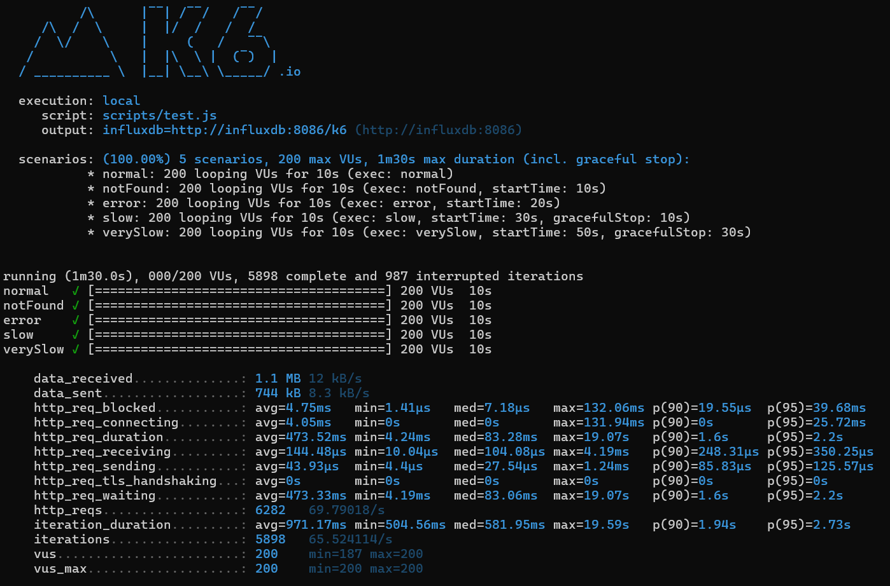

# 🛍️ Product Similarity API

This is a Spring Boot REST API developed as part of a backend technical challenge. The API provides details of similar products based on a given product ID, consuming data from an external service.

---

## 🚀 Features

- Get a list of similar products given a product ID
- Uses **Feign Client** to call external APIs
- Handles resilience with **Resilience4j** (`@Retry`, `@CircuitBreaker`, `@TimeLimiter`)
- Implements basic **in-memory caching** with `@Cacheable`
- Implements **API First** design using **OpenAPI 3.0**
- Auto-generates controller and model classes using **OpenAPI Generator**
- Full API documentation available via **Swagger UI**
- Docker support and `docker-compose` for testing

---

## 🧪 Endpoints

### `GET /product/{productId}/similar`

Returns a list of product details for products similar to the given ID.

#### Example response:

```json
[
  {
    "id": "2",
    "name": "Shirt Blue",
    "price": 49.99,
    "availability": true
  },
  ...
]
```

#### Error Responses

- `404 Not Found`: Returned when the original product does not exist or cannot be retrieved from the external service.

---

## 📚 API Documentation

The OpenAPI spec is defined in [`openapi.yml`](src/main/resources/openapi/openapi.yml), and the server implements an **API First** approach.

The specification is validated and the controller/model code is automatically generated via the OpenAPI Maven plugin.

### 🔗 Swagger UI

Once the app is running, you can access the interactive documentation here:

- http://localhost:5000/swagger-ui/index.html

---

## 🧠 Design Decisions & Architecture

- **OpenAPI First**: Promotes a contract-driven design, aligning development and documentation from the start.
- **Hexagonal Architecture (Ports & Adapters inspired)**: External calls are made via interfaces (e.g., Feign client), allowing the core logic to remain decoupled.
- **Parallel Streams**: Used for performance to fetch similar product details concurrently.
- **Resilience Patterns**: Via Resilience4j to ensure robustness against external service failures.
- **Fallback Methods**: Provide graceful degradation in case of API unavailability.
- **Caching**: Improves response time for repeated requests.

---

## ▶️ Running the App

### Prerequisites

- Java 17+
- Maven

### Build and Run

```bash
mvn clean install
mvn spring-boot:run
```

The app runs on port `5000`.

---

## 📦 Caching

Caching is enabled for the `getSimilarProducts(productId)` method using Spring's `@Cacheable`. It can be configured to use Redis or Caffeine for production environments.

---

## 📊 Performance Benchmarking

To evaluate the impact of applying performance and resilience techniques (Resilience4j, caching, and parallelism), load tests were executed using **K6** under the same stress conditions (200 virtual users, 5 scenarios).

| Metric                        | With Improvements     | Without Improvements     |
|------------------------------|------------------------|---------------------------|
| Total Requests               | `19,748`               | `6,282`                   |
| Avg. Request Duration        | `18.01ms`              | `473.52ms`                |
| Max. Request Duration        | `311ms`                | `19.07s`                  |
| Avg. Iteration Duration      | `518.99ms`             | `971.17ms`                |
| Interrupted Iterations       | `600`                  | `987`                     |
| Timeouts / Connection Errors | ❌ None                | ⚠️ Occasionally appeared  |

These results clearly show how the application benefits from:

- ✅ Resilience4j circuit breaking, retries and time limiting  
- ✅ Parallel product detail fetching  
- ✅ In-memory caching  
- ✅ Timeout configuration for external calls

### Test Result: With Improvements


### Test Result: Without Improvements


> 🧪 Load testing was executed using [K6](https://k6.io).  
> 🔄 Scenarios included: normal responses, 404 errors, failures, and slow/very slow backend simulations.

---

## 📌 Improvements

- Add Swagger/OpenAPI documentation ✅
- Replace in-memory cache with Redis
- Extend resilience configuration via `application.yml`
- Add circuit breaker metrics

---

## 📈 Future Improvements

The application could be improved in the following ways:

- **Add Tests**: Add unit and integration test coverage, especially for edge cases and error scenarios.
- **Add Observability**:
  - Structured logs using JSON format
  - Integration with centralized logging tools like ELK or Grafana Loki
  - Distributed tracing (e.g. OpenTelemetry)
- **Add Rate Limiting and Security**: Apply rate limiting, authentication, and authorization.
- **Add Metrics Endpoint**: Use Micrometer to expose Prometheus-compatible metrics.
- **Deploy to Cloud**: Add CI/CD pipeline and deploy to AWS/GCP/Azure.

---