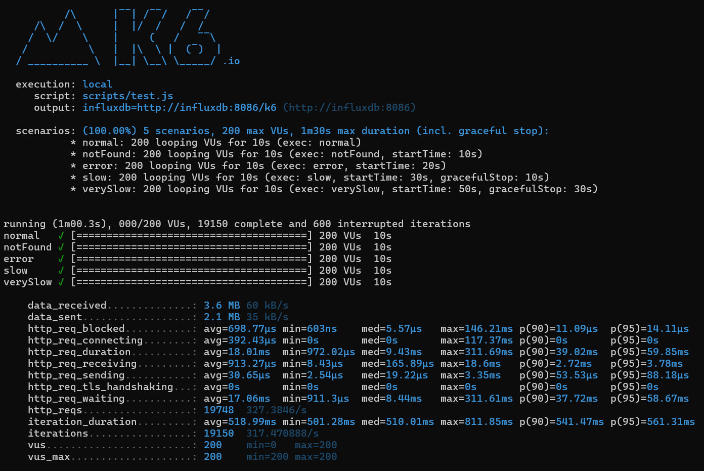

# 🛍️ Product Similarity API

This is a Spring Boot REST API App.  
The service provides **similar product recommendations**: given a product ID, it returns the details of all similar products.  

It acts as an **orchestrator** between the frontend and the data source (**Simulado service**), so the frontend only needs a single request instead of multiple calls.

---

## 📐 Architecture

```text
Frontend/Test → Product-Similarity → Simulado
```

- **Simulado**: mock service that stores product data and similar IDs.  
- **Product-Similarity**: microservice that receives a product ID, retrieves similar IDs from Simulado, fetches details for each product, and returns the full list.  
- **Frontend**: only calls Product-Similarity once and gets the complete result.  


---

## 🚀 Features

- Get a list of similar products given a product ID
- Uses **Feign Client** to call external APIs
- Handles resilience with **Resilience4j** (`@Retry`, `@CircuitBreaker`, `@TimeLimiter`)
- Implements basic **in-memory caching** with `@Cacheable`
- Implements **API First** design using **OpenAPI 3.0**
- Auto-generates controller and model classes using **OpenAPI Generator**
- Full API documentation available via **Swagger UI**
- **Structured JSON logs** with Logstash encoder
- **Micrometer + Prometheus metrics** exposed at `/actuator/prometheus`
- **Grafana dashboards** for metrics visualization
- Unit and integration tests with **JUnit 5 + Mockito**
- Docker support and `docker-compose` for testing and monitoring

---

## 🧪 Endpoints

### `GET /product/{productId}/similar`

Returns a list of product details for products similar to the given ID.

#### Example response:

```json
[
  {
    "id": "2",
    "name": "Shirt Blue",
    "price": 49.99,
    "availability": true
  },
  ...
]
```

#### Error Responses

- `404 Not Found`: Returned when the original product does not exist or cannot be retrieved from the external service.

---

## 📚 API Documentation

The OpenAPI spec is defined in [`openapi.yml`](src/main/resources/openapi/openapi.yml), and the server implements an **API First** approach.

The specification is validated and the controller/model code is automatically generated via the OpenAPI Maven plugin.

### 🔗 Swagger UI

Once the app is running, you can access the interactive documentation here:

- http://localhost:5000/swagger-ui/index.html


---

## 🧠 Design Decisions & Architecture

- **OpenAPI First**: contract-driven design aligning development and documentation.
- **Hexagonal Architecture**: external calls abstracted via interfaces (Feign clients).
- **Parallel Streams**: to fetch similar product details concurrently.
- **Resilience Patterns**: retries, circuit breakers, and timeouts with Resilience4j.
- **Fallback Methods**: for graceful degradation.
- **Caching**: improves response time for repeated requests.
- **Observability**: metrics, logs and dashboards for better monitoring.

---

## ▶️ Running the App

### Prerequisites

- Java 21
- Maven
- Docker & Docker Compose (for full stack)

### Build and Run

```bash
mvn clean install
mvn spring-boot:run
```

The app runs on port `5000`.

---

## 📦 Caching

Caching is enabled for the `getSimilarProducts(productId)` method using Spring's `@Cacheable`.  
It can be configured to use Redis or Caffeine for production environments.

---

## 📈 Observability

- **Metrics** available at:  
  - http://localhost:5000/actuator/prometheus
- **Grafana dashboards** for JVM, HTTP requests, and circuit breakers:  
  
- Structured logs in JSON format for easier aggregation with ELK or Loki.

More details in [docs/observability-load.md](docs/observability-load.md).

---

## 🧪 Testing

The project includes unit and integration tests with **JUnit 5** and **Mockito**:

- Controller: ✅ 100% coverage  
- Mapper: ✅ 100% coverage  
- Service: ~90% coverage  

Run all tests with:

```bash
mvn test
```

---

## 📊 Performance Benchmarking

To evaluate the impact of performance and resilience techniques, load tests were executed using **K6** under the same stress conditions (200 virtual users, 5 scenarios).

| Metric                        | With Improvements     | Without Improvements     |
|------------------------------|------------------------|---------------------------|
| Total Requests               | `19,748`               | `6,282`                   |
| Avg. Request Duration        | `18.01ms`              | `473.52ms`                |
| Max. Request Duration        | `311ms`                | `19.07s`                  |
| Avg. Iteration Duration      | `518.99ms`             | `971.17ms`                |
| Interrupted Iterations       | `600`                  | `987`                     |
| Timeouts / Connection Errors | ❌ None                | ⚠️ Occasionally appeared  |

### Test Result: With Improvements


### Test Result: Without Improvements


---

## 📌 Improvements

- Add Swagger/OpenAPI documentation ✅
- Add structured logs ✅
- Add Prometheus/Grafana observability ✅
- Extend resilience configuration via `application.yml`
- Replace in-memory cache with Redis
- Add circuit breaker metrics

---

## 📈 Future Improvements

- **Enhance Observability**:
  - Centralized logging with ELK or Grafana Loki
- **Add Rate Limiting and Security**: authentication, authorization and throttling.
- **Cloud Deployment**: CI/CD pipelines and deploy to AWS/GCP/Azure.

---